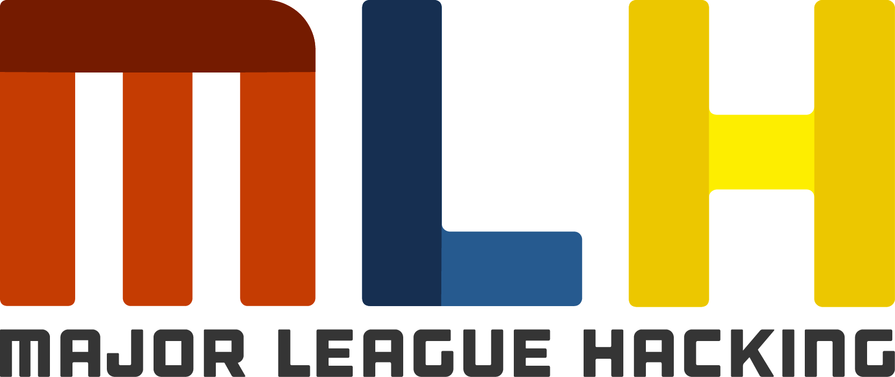

<h1> Git Started with GitHub #JuneJAM </h1>

## About The Event
`Git Started with GitHub` is a Localhost Workshop organized by Hack Club SRM, powered by GitHub Education, MLH, StickerMule and Hack Club!

Join us on 14th June to venture into the world of Open Source and Version Control and dig deeper into Git and GitHub. Absolutely beginner friendly and we are sure that you'll love the swags we have for all of our attendees!

## Perks of Attending
1. GitHub Education Pack Vouchers.
2. Stickers for every participant.
3. Special Badges for top performers.
4. Repl.it Pro Vouchers for top performers.
5. Notion Premium Account for top performers.
6. Adafruit Vouchers for all!

## Sponsors

## Code of Conduct
We will be following the same Code of Conduct as the Club, which is available [here](https://github.com/Hack-Club-SRM/Code-of-Conduct).